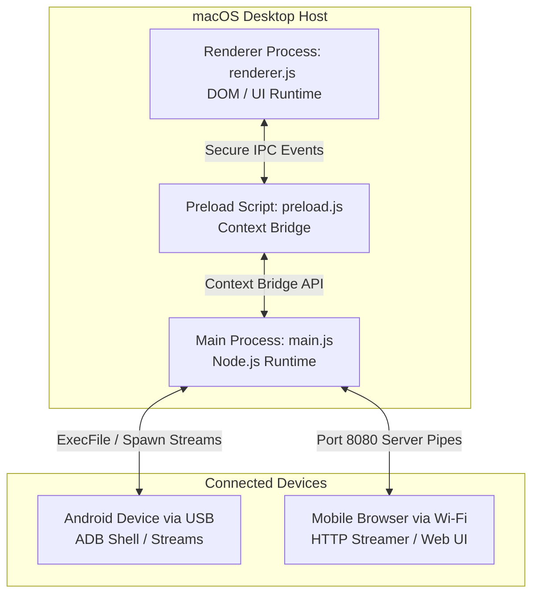

# DroidBridge — Technical Documentation & Development Guide

This document provides a comprehensive technical overview of **DroidBridge**, a premium Mac-native desktop application designed for bidirectional file transfers between macOS and Android devices. It details the system architecture, code organization, key module implementations, security mechanisms, and build setup.

---

## 📂 Table of Contents
1. [Architecture Overview](#1-architecture-overview)
2. [Project File Structure](#2-project-file-structure)
3. [Key Modules & Technical Explanation](#3-key-modules--technical-explanation)
4. [Wi-Fi Sharing Engine & Mobile Client](#4-wi-fi-sharing-engine--mobile-client)
5. [Security & Hardening Architecture](#5-security--hardening-architecture)
6. [UI Styling & Design Systems](#6-ui-styling--design-systems)
7. [Step-by-Step Initialization Guide](#7-step-by-step-initialization-guide)

---

## 1. Architecture Overview

DroidBridge is built using **Electron**, separating operations into two primary execution spaces to guarantee safety and responsiveness:



### A. The Main Process (`main.js`)
* **Environment**: Runs in a full Node.js environment.
* **Responsibilities**: Manages window lifecycles, executes native OS commands (`adb` executable), handles filesystem interactions (`fs`), hosts the Wi-Fi HTTP file server, and exposes secure Inter-Process Communication (IPC) handlers.

### B. The Preload Script (`preload.js`)
* **Environment**: Sandboxed renderer context with selective Node.js access.
* **Responsibilities**: Serves as a secure gateway. It uses `contextBridge.exposeInMainWorld` to pass a locked-down API namespace (`window.droidBridge`) to the frontend, preventing arbitrary Node.js scripts from executing in the UI.

### C. The Renderer Process (`renderer.js`)
* **Environment**: Standard Chromium web context (without Node.js access).
* **Responsibilities**: Handles UI rendering, triggers state transitions, captures mouse/keyboard selection events, and sends request signals across the IPC bridge.

---

## 2. Project File Structure

```text
droidbridge/
├── package.json          # Node dependency definition & packaging scripts
├── main.js               # Electron main process (ADB controller & server)
├── preload.js            # Secure context isolation bridge API
├── index.html            # Core desktop UI structure
├── styles.css            # Custom CSS custom properties, variables & layouts
├── renderer.js           # Desktop UI state machine and event handling
├── build-mac-icon.js     # Programmatic generator for native macOS icns format
├── setup-adb.sh          # Automated installer for Homebrew and platform-tools
├── icon.png              # Raw application logo asset
├── icon.icns             # Package compiled Apple Icon Image
└── RELEASE_NOTES.md      # Detailed release changes history
```

---

## 3. Key Modules & Technical Explanation

### A. Dynamic ADB Path Resolution (`findAdb`)
To run ADB commands, the Main Process dynamically locates the `adb` executable on the host Mac by checking typical installation paths:
```javascript
function findAdb() {
  if (cachedAdbPath !== undefined) return cachedAdbPath;
  const paths = [
    '/opt/homebrew/bin/adb',
    '/usr/local/bin/adb',
    path.join(os.homedir(), 'Library/Android/sdk/platform-tools/adb')
  ];
  for (const p of paths) {
    if (fs.existsSync(p)) {
      cachedAdbPath = p;
      return p;
    }
  }
  // Fallback check in system PATH
  try {
    const stdout = execSync('which adb', { encoding: 'utf8' });
    if (stdout.trim()) {
      cachedAdbPath = stdout.trim();
      return cachedAdbPath;
    }
  } catch {}
  cachedAdbPath = null;
  return null;
}
```

### B. Safe Process Spawning & Argument Escaping
To prevent **Shell Injection Vulnerabilities**, DroidBridge never invokes standard `exec` shell strings. Instead, it uses `execFile` or `spawn` to run ADB directly, passing parameters as an array of arguments.
However, because ADB passes arguments downstream to the Unix shell inside the Android device (`adb shell <cmd>`), path parameters containing spaces or special characters will undergo argument splitting on the phone. To counter this, a custom Unix-style escaper wraps parameters before they reach the ADB shell:

```javascript
function escapeShellArg(arg) {
  if (typeof arg !== 'string') return "''";
  if (arg.length === 0) return "''";
  // Wrap in single quotes, and escape existing single quotes by closing the quote,
  // appending a backslash-escaped quote, and opening a new single quote
  return "'" + arg.replace(/'/g, "'\\''") + "'";
}
```

### C. Bidirectional File Transfers (USB Streams)
For pushing files to the phone or pulling them to the Mac, DroidBridge launches ADB transfer processes. Because tracking ADB output progress streams is historically flaky, progress percentage is computed based on individual file indexes inside the transfer queue:
```javascript
// Pushing files to remote storage
for (let i = 0; i < localPaths.length; i++) {
  const filePath = localPaths[i];
  const fileName = path.basename(filePath);
  
  win.webContents.send('transfer-progress', {
    current: i,
    total: localPaths.length,
    fileName,
    percent: Math.round((i / localPaths.length) * 100)
  });

  await runAdb(['-s', deviceId, 'push', filePath, remotePath + '/']);
}
```

---

## 4. Wi-Fi Sharing Engine & Mobile Client

DroidBridge includes a zero-configuration wireless transfer system that hosts a lightweight server on port `8080` (or the next available port) to serve files locally.

### A. QR Code Generation
When Wi-Fi mode is toggled, DroidBridge uses the local network interface IP to construct a target URL and converts it to an offline Base64 QR Code string dynamically using standard matrix layouts, rendering it instantly on the landing modal.

### B. Safe Ancestry Path Resolution
To prevent users from navigating or uploading files outside the designated shared folder (Directory Traversal), the server verifies permissions before reading or writing any files:
```javascript
function isWifiPathAllowed(targetPath) {
  try {
    const resolvedTarget = path.resolve(targetPath);
    // Find closest existing directory ancestry
    let dir = resolvedTarget;
    while (dir && dir !== '/' && !fs.existsSync(dir)) {
      dir = path.dirname(dir);
    }
    const resolvedTargetReal = fs.realpathSync(dir);
    const resolvedShare = fs.realpathSync(wifiSharedDir);
    return resolvedTargetReal.startsWith(resolvedShare);
  } catch {
    return false;
  }
}
```

### C. Inline Previews vs. Attachment Downloads
When the mobile client requests a file, the server checks the `inline=1` URL query parameter. 
* If `inline=1` is passed, the file is sent with its corresponding MIME type header (`Content-Type: application/pdf` or `image/jpeg`).
* If missing, the server appends a `Content-Disposition: attachment` header to force a download.

---

## 5. Security & Hardening Architecture

DroidBridge implements multiple layers of security to prevent unauthorized access and execution:

### A. Cryptographic Nonce-based CSP
Every HTML payload served by the Wi-Fi server includes a dynamically generated Content Security Policy (CSP). A secure 128-bit random hex token (nonce) is generated per request:
```javascript
const nonce = crypto.randomBytes(16).toString('hex');
res.writeHead(200, {
  'Content-Security-Policy': `default-src 'self'; script-src 'self' 'nonce-${nonce}'; style-src 'self' 'nonce-${nonce}'; img-src 'self' data:; media-src 'self' blob:;`,
  'Content-Type': 'text/html'
});
```

### B. Refactored Event Decoupling
To comply with strict CSP policies, all inline javascript elements (e.g. `onclick="handler()"`) and inline styles (`style="..."`) are prohibited. All interactive components are wired up via Event Listeners in the DOM:
```javascript
// Decoupled script binding example
const btn = document.createElement('button');
btn.className = 'open-btn';
btn.textContent = 'Open';
btn.addEventListener('click', () => navigateInto(file.name));
```

---

## 6. UI Styling & Design Systems

DroidBridge features a dark, glassmorphic layout system constructed with CSS custom variables:

### A. Visual Balance & Padding
To prevent columns from shifting horizontally when scrolling through empty vs. populated folders, the layout forces scrollbars to remain visible (`overflow-y: scroll`) and compensates header alignments with custom offset dimensions:
```css
.file-list {
  flex: 1;
  overflow-y: scroll; /* Lock scrollbar tracks */
  padding: 4px 0;
}
.file-list-header {
  display: grid;
  grid-template-columns: 28px 1fr 100px 140px;
  padding: 8px 24px 8px 16px; /* Offset compensation for scrollbar */
}
```

### B. Color Tokens (CSS Variables)
```css
:root {
  --bg-color: #08080c;
  --surface-color: #111119;
  --border-color: rgba(255, 255, 255, 0.05);
  --primary-color: #6c5ce7;
  --primary-glow: rgba(108, 92, 231, 0.15);
  --text-primary: #e2e2e9;
  --text-muted: #5f5f7a;
}
```

---

## 7. Step-by-Step Initialization Guide

To recreate this project from scratch:

### Step 1: Initialize the Project
Create a new directory and initialize Node.js:
```bash
mkdir DroidBridge && cd DroidBridge
npm init -y
```

### Step 2: Install Electron Development Dependencies
```bash
npm install electron electron-packager --save-dev
```

### Step 3: Configure `package.json`
Configure execution and build scripts inside your `package.json` file:
```json
{
  "name": "droidbridge",
  "version": "1.1.0",
  "main": "main.js",
  "scripts": {
    "start": "electron .",
    "package": "node build-mac-icon.js && electron-packager . DroidBridge --platform=darwin --overwrite --icon=icon.icns"
  }
}
```

### Step 4: Write Core Files
Create `main.js`, `preload.js`, `renderer.js`, `index.html`, and `styles.css` containing the modules described in this document.

### Step 5: Package the App
To package the app into a standalone Mac `.app` application:
```bash
npm run package
```
The application will be compiled inside the `DroidBridge-darwin-arm64/` directory, ready to run.
